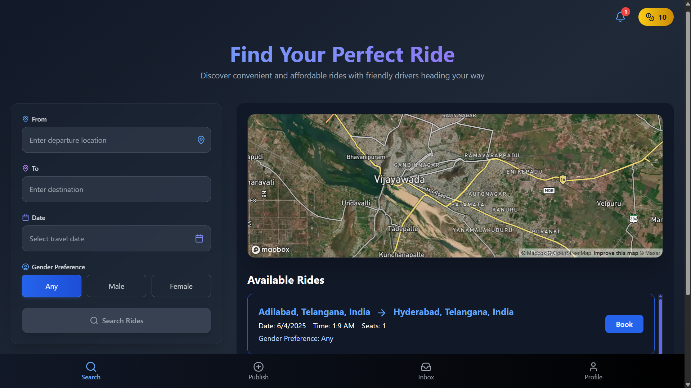

# 🚗 KrowdMove - Vehicle Pooling Web App

KrowdMove is a community-driven vehicle pooling platform designed to reduce travel costs, traffic congestion, and carbon footprint. Developed with a vision to make daily commuting more efficient and sustainable, KrowdMove connects users who are traveling on the same route, enabling them to share rides easily and securely.

## 👥 Team Bug Busters

We are **Team Bug Busters**, a group of enthusiastic developers passionate about building tech solutions for real-world problems. KrowdMove is our take on solving urban mobility challenges through collaboration and smart tech.

## 🌟 Features

- 🔐 **User Authentication** – Sign up and log in securely.
- 📍 **Route-Based Pooling** – Match with users traveling to similar destinations.
- 🚘 **Offer or Join a Ride** – Users can either host or join available rides.
- 📆 **Schedule Management** – Set time, pickup points, and route preferences.
- 💬 **In-App Communication** – Seamless interaction between ride sharers.
- 🧠 **Smart Suggestions** – Personalized recommendations based on past routes.
- 🌱 **Eco-Friendly Travel** – Encouraging fewer vehicles on the road.

## 🎯 Objective

The main goal of KrowdMove is to:

- Promote **eco-conscious commuting** by reducing the number of single-occupancy vehicles.
- Provide a **cost-effective** and **convenient** travel option for daily commuters.
- Enable **social connection** through shared rides, enhancing community bonding.

## 🔧 Tech Stack

- **Frontend**: HTML, CSS, JavaScript, Bootstrap
- **Backend**: Node.js / Django / Flask *(Update this based on what you used)*
- **Database**: MongoDB / MySQL / Firebase *(Update accordingly)*
- **APIs/Services**: Google Maps API (for route mapping) *(If applicable)*

## 🚀 Demo

[Live Demo](https://projectk-3fw9.vercel.app/register)*

## 📸 Screenshots

## Available Scripts

## Before starting install the node_modules by npm install

## do the same in the ride-sharing-app/client and ride-sharing-app/server 

In the project directory, you can run:

### `npm start` if running in a local device

Runs the app in the development mode.\
Open [http://localhost:3000](http://localhost:3000) to view it in your browser.

The page will reload when you make changes.\
You may also see any lint errors in the console.

Thank you for checking out **KrowdMove**! Together, let’s move smarter, cheaper, and greener. 🌍

